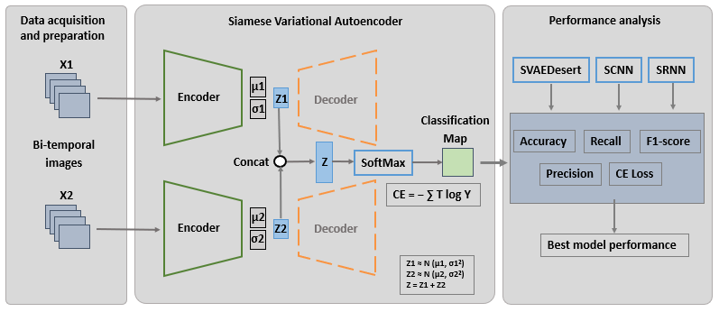

# SVAEDesert: Deep Learning Siamese algorithm for desertification detection
This is a Python implementation of the paper: SVAEDesert: Siamese Variational Autoencoder for Desertification detection using satellite imagery.

The aim oh this project is to provide a novel framework dedicated to desertification detection from satellite images based on the Siamese5 Variational Autoencoder (SVAE).
The main contributions of SVAEDesert are:
- SVAEDesert, a novel  framework dedicated to desertification detection from satellite images based on the Siamese Variational Autoencoder (SVAE) in order to reduce clustering errors, enhance feature extraction and conserve the spatial consistency of the extracted features.
- An in-depth experimental evaluation to assess the behavior of the proposed framework in comparison with the Siamese Convolutional Neural Network (SCNN) and the Siamese Recurrent Network (SRNN) in the study area  covering arid regions in the south of Tunisia.

## Hardware and Software Requirements
This code was tested on a system with the following specifications:
- OS: Win11
- Memory (RAM): 8GB
- Disk storage: 1TB
- CPU: Intel(R) Core(TM) i5-8400 CPU @ 2.80GHz 2.81 GHz

The model is implemented using Python3 with dependencies:
- tensorflow 2.6.2
- Keras 2.6.0
- numpy 1.19.5 
- pandas 1.1.5
- scipy 1.5.4 
- scikit\_learn 0.24.2
- matplotlib 3.3.4  
## Dataset
The RGB/NDVI data used in this study are dowloaded from the Google Earth Engine cloud computing platform (https://earthengine.google.com)
